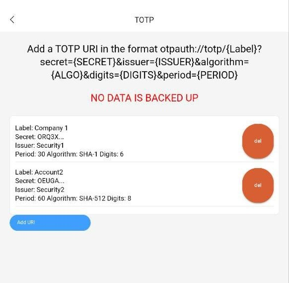
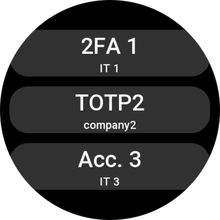
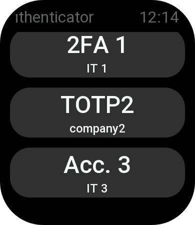
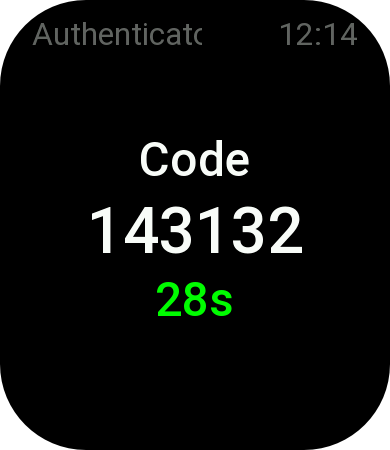
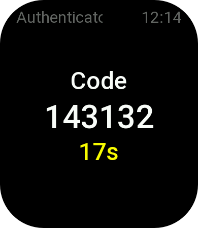
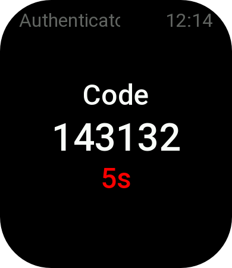

# Fork of ZoLArk173 Authenticator Zepp OS app

Big thanks to [ZoLArk173](https://github.com/ZoLArk173) and [Alpaca131](https://github.com/Alpaca131) for the idea and original code
The application is now available in the Zepp Store

- added advanced options:
  - `otpauth://totp/{ACCOUNT_NAME}?secret={SECRET}&issuer={ISSUER}&algorithm={ALGO}&digits={DIGITS}&period={PERIOD}`
    - `{ALGO}`: SHA1 (default if not specified), SHA256, SHA512
    - `{DIGITS}`: how many digits the code has (more than 10 are useless as only 31bit are used for the code)
    - `{PERIOD}`: in seconds, (30 default if not specified)
- fixed base32 decoder
- fixed label (https://github.com/google/google-authenticator/wiki/Key-Uri-Format#label)
- changed to Zepp OS 2
- auto update expired codes
- New storage API from 2.0
- Dead simple UI, works without modifications on GTR4 and GTS4 (and looks good on my opinion)
  - should work on GTR3, GTR3-Pro, GTS3 if they ever get the Zepp OS 2 update

# Screenshots
## App settings

## Watch App on GTR4



## Watch App on GTS4





# Old Readme
# Authenticator

An 2FA app for Zepp OS

# Features

- Display 2FA codes on the Zepp OS enabled watches.
- Manage 2FA codes inside Zepp app settings page.

# Usage

After install the app, go to Authenticator setting under "More Settings" on Zepp app. You can add 2FA URI to the list by tapping the blue button.
Now, the URI must be formatted as following:

```
otpauth://totp/{ACCOUNT_NAME}?secret={SECRET}&issuer={ISSUER}
```

- `{ACCOUNT_NAME}`: The account name, e.g. alice@gmail.com
  - Notice that some character like `:` or `@` will be converted to other code when you copy. You can edit it if it doesn't display properly.
- `{SECRET}`: The secret key
- `{ISSUER}`: The issuer of the code, which will be display as the title. e.g. Google

After adding URI, you can open the Authenticator app on the watch. The watch will sync the data from the phone every time it launched. You may see the 2FA 6-digit code on the screen!

# Future Improvements

This app is a prototype. There are a lot of things can be improved.

- Cannot rearrange 2FA codes.
- Cannot import URI without manual edit.
- Won't auto update every 30 secs.
- The UI of the settings page is less than desired.
- The UI on the GTS 3 is less than desired.

# Notes

Some part of code is come from [demos of Zepp OS developer documentation](https://github.com/zepp-health/zeppos-samples).

2FA code calculation part is come from [iamyuthan/2FA-Solver](https://github.com/iamyuthan/2FA-Solver).

Special thanks to them!

# Random

There are only several apps that available to Zepp OS enabled watches. And some of them are kind of useless or games. It is kind of disappointing that Zepp OS is capable of running third-party apps while maintaining the excellent battery life, while there are only a few useful apps in the App Store. Then a 2FA app comes to mind,  a useful application that can show 6-digit code handy when you login. It is also my first time developing with JavaScript, which you can tell from by terrible coding style in this project.
